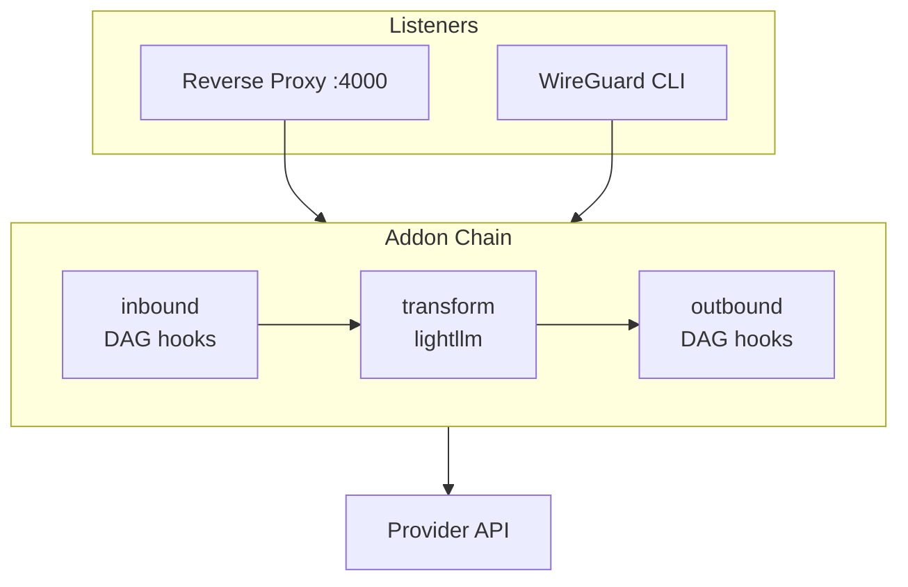

# `ccproxy` — CLI Proxy [](https://github.com/starbaser/ccproxy)

> [Discord](https://starbased.net/discord)

ccproxy is a transparent network interceptor for LLM tooling and AI harnesses,
built on mitmproxy and WireGuard with full TLS inspection and Wireshark keylog
export. Originally purpose-built for Claude Code, ccproxy now works with any LLM
client: Aider, Cursor, OpenAI SDK, or anything else that speaks HTTP. It jails a
process inside a rootless WireGuard namespace, intercepts at the network layer,
and feeds it through a DAG-driven pipeline that can decompose, transform, and
re-route traffic between providers.
Cross-provider request and response transformation is handled by `lightllm`, a
surgical adapter and streaming-FSM layer inside ccproxy — no LiteLLM proxy
subprocess, no gateway server.

**New in 2.0**: Codex/OpenAI Responses support with packaged request shaping,
plus DeepSeek V4 routing for Anthropic-format requests through DeepSeek's
`/anthropic/v1/messages` endpoint. See [Configuration](#configuration) for
the routing setup.

The hook pipeline is your extension point for building mods and taking control
of your LLM usage while respecting terms of service:
- **Cross-provider routing**: redirect or transform requests between Anthropic,
  Gemini, OpenAI, DeepSeek, Perplexity Pro, and Anthropic-compatible forks.
- **Compliance shaping**: replay packaged, sanitized SDK compliance envelopes
  for built-in providers while injecting your actual request content at runtime.
- **MCP bridging**: add unsupported MCP features to any client:
  [sampling](https://modelcontextprotocol.io/specification/2025-11-25/client/sampling)
  via sentinel key detection,
  [server notifications](https://modelcontextprotocol.io/specification/2025-11-25/basic/index#notifications)
  bridged into the LLM context via ccproxy’s `/mcp` endpoint, and experimental
  [tasks](https://modelcontextprotocol.io/specification/2025-11-25/basic/utilities/tasks)
  support.

> Feedback and contributions welcome —
> [open an issue](https://github.com/starbaser/ccproxy/issues) or submit a PR.

## Installation

### Platform support

| Platform | Reverse proxy (`ccproxy start`) | WireGuard namespace jail (`ccproxy run --inspect`) |
|----------|---|---|
| Linux | ✅ | ✅ |
| Windows (WSL2) | ✅ | ✅ |
| macOS | ✅ | ❌ — requires Linux namespaces |

WSL2 is fully supported because it *is* Linux. Native Windows is not — use WSL2.
On macOS, the reverse proxy listener (`ccproxy start` + SDK use) works fine, but
the namespace jail (`ccproxy run --inspect`) requires Linux kernel features
(unprivileged user/net namespaces, `slirp4netns`, `iptables` NAT) that have no
macOS equivalent.

### Windows via WSL2

The recommended Windows install is the `ccproxy.wsl` distro artifact. It is
built on NixOS-WSL and includes ccproxy plus the Linux namespace tools required
by `ccproxy run --inspect`.

```powershell
# Requires Store WSL 2.4.4 or newer.
wsl --update
wsl --version
wsl --install --from-file ccproxy.wsl
wsl -d ccproxy
```

Inside the distro:

```bash
ccproxy init
ccproxy start
ccproxy namespace status --json
ccproxy namespace doctor --json
```

Tier 1 Windows support is Windows 11 22H2+ with Store-distributed WSL2,
systemd enabled, and mirrored networking recommended. Windows 10 and older WSL
networking are best-effort. WSL1 and native Windows without WSL are unsupported.

Advanced users can still use Ubuntu on WSL2 with systemd and Nix, but the
release artifact is the primary out-of-box path.

### Linux

The WireGuard namespace jail needs a small set of system tools on `PATH`:
`slirp4netns`, `wireguard-tools` (`wg`), `iproute2` (`ip`), `iptables`,
`util-linux` (`unshare`, `nsenter`), and `procps` (`sysctl`).

```bash
# Debian / Ubuntu
sudo apt update
sudo apt install -y slirp4netns wireguard-tools iproute2 iptables procps

# Fedora
sudo dnf install -y slirp4netns wireguard-tools iproute iptables-nft procps-ng

# Arch
sudo pacman -S slirp4netns wireguard-tools iproute2 iptables procps-ng

# NixOS — provided via the project devShell (`nix develop`)
```

Then install ccproxy:

```bash
# Recommended: uv tool (isolated venv, console scripts on PATH)
uv tool install claude-ccproxy

# Alternative: pip
pip install claude-ccproxy
```

On Ubuntu 24.04+, unprivileged user namespaces are restricted by AppArmor by
default. Either run once:

```bash
sudo sysctl -w kernel.apparmor_restrict_unprivileged_userns=0
```

…or add a path-scoped AppArmor profile (see
[rootless-containers/rootlesskit][rk-apparmor]).

[rk-apparmor]: https://github.com/rootless-containers/rootlesskit/blob/main/docs/getting-started.md#ubuntu-2310-and-later

### macOS

Only the reverse proxy is supported. No system packages are required.

```bash
uv tool install claude-ccproxy
# or
pip install claude-ccproxy
```

`ccproxy start` and SDK use (`ANTHROPIC_BASE_URL=http://localhost:4000`) work
the same as on Linux. `ccproxy run --inspect` will fail fast with a clear error
listing the missing Linux-only tools.

### Verify

```bash
ccproxy --help
ccproxy init
ccproxy status --proxy --inspect    # exit 3 = both down (expected, nothing running yet)
```

## Quick Start

```bash
# Initialize config template at ~/.config/ccproxy/ccproxy.yaml
ccproxy init

# Start the inspector server (foreground)
ccproxy start
```

**SDK use**: point any OpenAI-compatible client at the reverse proxy listener:

```bash
export ANTHROPIC_BASE_URL=http://localhost:4000
claude -p "hello"
```

**Transparent capture**: run a command inside the WireGuard namespace jail (all
traffic intercepted):

```bash
ccproxy run --inspect -- claude -p "hello"
```

## Architecture

Traffic enters through one of two listeners, passes through a fixed three-stage
addon chain, and exits directly to the provider API.



**Addon chain** (fixed order):
`ReadySignal → InspectorAddon → FingerprintCaptureAddon → MultiHARSaver → ShapeCaptureAddon → inbound DAG → transform → outbound DAG → TransportOverrideAddon → AuthAddon → GeminiAddon → PerplexityAddon → EgressSanitizerAddon`

`AuthAddon` and `GeminiAddon` sit after the outbound pipeline so they see
ccproxy-finalized requests/responses. `AuthAddon` owns 401-detect → refresh →
replay. `GeminiAddon` owns Gemini capacity fallback (sticky retry + fallback
chain on 429/503) and cloudcode-pa envelope unwrapping.

**lightllm** converts request and response bodies through ccproxy's own
adapter layer and streaming FSMs. URL rewriting and auth injection are owned by
the inspector route and `Provider` config, while `lightllm` owns wire-format
conversion.

**SSE streaming**: `SSEPipeline` handles cross-provider streaming by parsing
SSE events into ccproxy's response IR and rendering each chunk back to the
listener's wire format.

## Configuration

`ccproxy init` writes a template to `~/.config/ccproxy/ccproxy.yaml`. Config is
also read from `$CCPROXY_CONFIG_DIR/ccproxy.yaml`.

```yaml
ccproxy:
  port: 4000

  # Provider entries keyed by sentinel suffix. The sentinel key
  # sk-ant-oat-ccproxy-{name} resolves to providers[name] for token
  # injection and routing.
  providers:
    anthropic:
      auth:
        type: command
        command: "jq -r '.claudeAiOauth.accessToken' ~/.claude/.credentials.json"
      host: api.anthropic.com
      path: /v1/messages
      type: anthropic

    deepseek:
      auth:
        type: command
        command: "printenv DEEPSEEK_API_KEY"
        header: x-api-key
      host: api.deepseek.com
      path: /anthropic/v1/messages
      type: anthropic

  hooks:
    inbound:
      - ccproxy.hooks.inject_auth
      - ccproxy.hooks.extract_session_id
    outbound:
      - ccproxy.hooks.gemini_cli
      - ccproxy.hooks.pplx_stamp_headers
      - ccproxy.hooks.inject_mcp_notifications
      - ccproxy.hooks.verbose_mode
      - ccproxy.hooks.shape
      - ccproxy.hooks.commitbee_compat

  inspector:
    # Optional regex-matched override rules layered on top of the
    # sentinel-driven providers map. Default is empty: most routing
    # comes from `providers` via inject_auth's sentinel detection.
    transforms:
      - match_path: ^/v1/chat/completions
        match_model: ^gpt-4o
        action: transform
        dest_provider: anthropic
        dest_model: claude-haiku-4-5-20251001
```

**Transform matching**: `match_host` (optional regex, checked against
`pretty_host` + Host header + X-Forwarded-Host), `match_path` (regex,
default `.*`), `match_model` (regex, optional). First match wins.
Three actions: `redirect` (default — rewrite destination, preserve body),
`transform` (cross-format via lightllm), `passthrough` (forward unchanged).
Auth resolves through `dest_provider` → `providers[name]`.

### Auth source types

`Provider.auth` dispatches on `type:`. Two static loaders return whatever the
underlying source holds; OAuth loaders own the refresh lifecycle in-process.

| `type` | What it is | When to use |
| --- | --- | --- |
| `command` | Run a shell command, return stdout | Static API keys, opnix/SOPS secret commands, env-var injection |
| `file` | Read a file, return contents | Static API keys stored in a managed secret file |
| `anthropic_oauth` | In-process Anthropic OAuth refresh | Share `~/.claude/.credentials.json` with Claude Code CLI |
| `google_oauth` | In-process Google/Gemini OAuth refresh | Share `~/.gemini/oauth_creds.json` with gemini-cli |
| `codex_oauth` | In-process Codex OAuth refresh | Share `~/.codex/auth.json` with Codex CLI |

`command` and `file` are not OAuth — they have no expiry awareness and never
call out to a refresh endpoint. ccproxy reads them on every resolve; rotation
happens out-of-band through whichever secret manager produced the value.

`anthropic_oauth` and `google_oauth` extend the same form-encoded
`AuthSource` base. `codex_oauth` follows Codex's ChatGPT auth-file schema: it
reads `~/.codex/auth.json`, refreshes JWT access tokens through OpenAI's OAuth
endpoint, atomically writes the updated token envelope, and stamps companion
`ChatGPT-Account-ID` / `X-OpenAI-Fedramp` headers derived from the same file.

A static API key for DeepSeek alongside an OAuth-refresh entry for Anthropic:

```yaml
ccproxy:
  providers:
    anthropic:
      auth:
        type: anthropic_oauth
        file_path: ~/.claude/.credentials.json
        access_path: claudeAiOauth.accessToken
        refresh_path: claudeAiOauth.refreshToken
        expiry_path: claudeAiOauth.expiresAt
        header: authorization
      host: api.anthropic.com
      path: /v1/messages
      type: anthropic

    deepseek:
      auth:
        type: command
        command: "printenv DEEPSEEK_API_KEY"
        header: x-api-key
      host: api.deepseek.com
      path: /anthropic/v1/messages
      type: anthropic
```

**Hook config**: hooks in each stage list are topologically sorted by
`@hook(reads=..., writes=...)` dependency declarations and executed in parallel
DAG order. Hooks can be parameterized:

```yaml
hooks:
  outbound:
    - hook: ccproxy.hooks.some_hook
      params:
        key: value
```

Per-request overrides via header: `x-ccproxy-hooks: +hook_name,-other_hook`.

### Sharing credentials with the Claude Code CLI

If you also run the Claude Code CLI on the same machine, point ccproxy's
`anthropic` provider at the CLI's own credential file. Both tools then read
*and* write the same JSON, so a refresh from either side is visible to the
other on the next read.

```yaml
ccproxy:
  providers:
    anthropic:
      auth:
        type: anthropic_oauth
        file_path: ~/.claude/.credentials.json
        access_path: claudeAiOauth.accessToken
        refresh_path: claudeAiOauth.refreshToken
        expiry_path: claudeAiOauth.expiresAt
        header: authorization
      host: api.anthropic.com
      path: /v1/messages
      type: anthropic
```

The four glom paths declare the file's schema (`{claudeAiOauth: {accessToken,
refreshToken, expiresAt, ...}}`), so existing siblings the CLI maintains
(`scopes`, `subscriptionType`, etc.) are preserved on write. The atomic
write-back (tmpfile → fsync → rename → chmod 0600) keeps the file consistent
even if both tools refresh concurrently.

## Hook Pipeline

| Hook | Stage | Purpose |
| --- | --- | --- |
| `inject_auth` | inbound | Sentinel key (`sk-ant-oat-ccproxy-{provider}`) substitution from `providers` |
| `extract_session_id` | inbound | Parses `metadata.user_id` → stores session_id on `ctx.metadata.session_id` |
| `gemini_cli` | outbound | Single hook for Gemini sentinel-key traffic: `v1internal` envelope wrap, conditional UA masquerade, path rewrite to `cloudcode-pa`, and unwrap on the way back |
| `pplx_stamp_headers` | outbound | Converts the Perplexity Pro sentinel token into the browser-shaped cookie/auth header bundle |
| `inject_mcp_notifications` | outbound | Injects buffered MCP terminal events as synthetic tool_use/tool_result |
| `verbose_mode` | outbound | Strips `redact-thinking-*` from `anthropic-beta` header |
| `shape` | outbound | Replays a packaged or local shape and stamps content fields from the incoming request |
| `commitbee_compat` | outbound | Last-mile compatibility shim for commitbee |

## Shape Replay

Anthropic, Gemini, and Codex/OpenAI Responses traffic depend on shape replay.
ccproxy ships sanitized packaged defaults for all three providers. For
Anthropic, the shape is the only source of the Claude Code identity headers
(user-agent, anthropic-beta, etc.) and the billing-header block — there is no
synthetic-identity fallback hook anymore. For Codex, the packaged
`openai_responses` shape carries only the public request envelope; account
routing headers come from `codex_oauth` at runtime. Normal users do not need to
capture a shape before using the packaged defaults. If a packaged shape goes
stale for a future upstream SDK release, update ccproxy to a release with
refreshed packaged defaults. If no fixed release is available yet, follow the
manual rescue path in
[Request Shaping](docs/shaping.md#manual-shaping-when-a-packaged-default-is-stale).

Codex traffic is routed to ChatGPT's Codex backend, not the public OpenAI
Responses endpoint. Use streaming Responses requests; ccproxy preserves the
captured Codex instruction envelope, normalizes public SDK string input into
Codex's verbose message form, and enforces `store: false`. Public Responses
fields unsupported by the Codex backend, such as `max_output_tokens`, should be
left unset for the default `codex` provider.

## CLI Reference

```bash
ccproxy start                          # Start server (inspector mode, foreground)
ccproxy run [--inspect] -- <command>   # Run command with proxy env vars / WireGuard namespace jail
ccproxy status [--json]                # Show running state
ccproxy init [--force]                 # Initialize config in ~/.config/ccproxy/
ccproxy logs [-f] [-n LINES]           # View logs

# Flow inspection (all commands accept repeatable --jq filters)
ccproxy flows list [--json] [--jq FILTER]...     # List flow set
ccproxy flows dump [--jq FILTER]...              # Multi-page HAR of flow set
ccproxy flows diff [--jq FILTER]...              # Sliding-window diff across set
ccproxy flows compare [--jq FILTER]...           # Per-flow client-vs-forwarded diff
ccproxy flows clear [--all] [--jq FILTER]...     # Clear flow set (--all bypasses filters)

# Shape artifacts
ccproxy shapes audit [--directory PATH]          # Audit packaged .mflow artifacts
ccproxy shapes save PROVIDER [--jq FILTER]...    # Advanced: write/update local shape patch
ccproxy shapes save PROVIDER --mflow             # Advanced: write request-only .mflow override
```

`ccproxy run` (without `--inspect`) sets `ANTHROPIC_BASE_URL`,
`OPENAI_BASE_URL`, and `OPENAI_API_BASE` in the subprocess environment and
routes traffic through the reverse proxy listener.

`ccproxy run --inspect` wraps the command in a rootless WireGuard network
namespace jail — all outbound traffic is transparently intercepted regardless of
SDK configuration.

## Inspecting Flows

All `flows` subcommands operate on a resolved **set** of flows.
The set is built by a pipeline:

```
GET /flows → config default_jq_filters → CLI --jq filters → final set
```

The `--jq` flag is repeatable.
Each filter must consume a JSON array and produce a JSON array.
Multiple filters chain via jq’s `|` operator:

```bash
# Only Anthropic API calls
ccproxy flows list --jq 'map(select(.request.pretty_host == "api.anthropic.com"))'

# Only POST /v1/messages
ccproxy flows list --jq 'map(select(.request.path | startswith("/v1/messages")))'

# Chain filters: Anthropic POSTs with 200 status
ccproxy flows list \
  --jq 'map(select(.request.pretty_host == "api.anthropic.com"))' \
  --jq 'map(select(.request.method == "POST"))' \
  --jq 'map(select(.response.status_code == 200))'
```

Config-level defaults apply before CLI filters, so you can set a baseline in
`ccproxy.yaml`:

```yaml
flows:
  default_jq_filters:
    - 'map(select(.request.path | startswith("/v1/messages")))'
```

### Listing flows

```bash
# Rich table (default)
ccproxy flows list

# Raw JSON
ccproxy flows list --json

# Filtered table
ccproxy flows list --jq 'map(select(.request.path | startswith("/v1/messages")))'
```

```
┏━━━━━━━━━━┳━━━━━━━━━┳━━━━━━━┳━━━━━━━━━━━┳━━━━━━━━━━━┳━━━━━━━━━━┳━━━━━━━━━━━━━━┓
┃ ID       ┃ Method  ┃  Code ┃ Host      ┃ Path      ┃ UA       ┃ Time         ┃
┡━━━━━━━━━━╇━━━━━━━━━╇━━━━━━━╇━━━━━━━━━━━╇━━━━━━━━━━━╇━━━━━━━━━━╇━━━━━━━━━━━━━━┩
│ 3c9c224c │ POST    │   200 │ api.anth… │ /v1/mess… │ claude-… │ 42 seconds   │
│          │         │       │           │           │ (extern… │ ago          │
│ 6cc161e9 │ POST    │   200 │ api.anth… │ /v1/mess… │ claude-… │ 29 seconds   │
│          │         │       │           │           │ (extern… │ ago          │
└──────────┴─────────┴───────┴───────────┴───────────┴──────────┴──────────────┘
```

### Diffing consecutive requests

`flows diff` performs a sliding-window unified diff over request bodies.
For a set `[f0, f1, f2]`, it produces diffs `f0→f1` and `f1→f2`. Requires at
least 2 flows.

```bash
ccproxy flows diff --jq 'map(select(.request.path | startswith("/v1/messages")))'
```

```diff
--- flow:3c9c224c
+++ flow:6cc161e9
@@ -26,7 +26,7 @@
         {
           "type": "text",
-          "text": "what's 2+2",
+          "text": "what's 3+3",
           "cache_control": {
```

### Comparing client vs forwarded requests

`flows compare` diffs the pre-pipeline client request against the post-pipeline
forwarded request for each flow.
This shows what ccproxy’s hook pipeline and lightllm transform actually changed.
Supports 1+ flows.

```bash
ccproxy flows compare --jq 'map(select(.request.path | startswith("/v1/messages")))'
```

When the pipeline rewrites the request (e.g. Anthropic → Gemini transform),
you’ll see URL changes and body diffs:

```
╭──────── URL change — abc12345 ────────╮
│ - https://api.anthropic.com/v1/messages│
│ + https://generativelanguage.googleapi…│
╰───────────────────────────────────────╯
╭──────── Body diff — abc12345 ─────────╮
│ --- client:abc12345                    │
│ +++ forwarded:abc12345                 │
│ @@ -1,5 +1,5 @@                       │
│ ...                                    │
╰───────────────────────────────────────╯
```

When no transform is applied (same-provider passthrough), the output confirms
the bodies are identical:

```
3c9c224c: request bodies are identical.
6cc161e9: request bodies are identical.
```

### Dumping HAR

`flows dump` exports the flow set as a multi-page HAR 1.2 file.
Each flow becomes one page with two entries:

| Entry | Content |
| --- | --- |
| `entries[2i]` | Forwarded request + upstream response |
| `entries[2i+1]` | Client request (pre-pipeline snapshot) + upstream response |

```bash
# Dump all flows to a HAR file (open in Chrome DevTools / Charles / Fiddler)
ccproxy flows dump > all.har

# Dump only LLM requests
ccproxy flows dump --jq 'map(select(.request.path | startswith("/v1/messages")))' > llm.har

# Query HAR with jq
ccproxy flows dump | jq '.log.pages | length'           # page count
ccproxy flows dump | jq '.log.entries[0].request.url'    # first forwarded URL
```

### Clearing flows

```bash
# Clear only matching flows (respects --jq filters)
ccproxy flows clear --jq 'map(select(.request.path | startswith("/v1/messages")))'
# => Cleared 2 flow(s).

# Clear everything (bypasses all filters)
ccproxy flows clear --all
```

## Development

```bash
git clone https://github.com/starbaser/ccproxy.git
cd ccproxy
direnv allow        # activates the nix devShell

just up             # start dev services (process-compose, detached, port 4001)
just down           # stop dev services
just test           # uv run pytest
just lint           # uv run ruff check .
just fmt            # uv run ruff format .
just typecheck      # uv run mypy src/ccproxy
```

The dev instance runs on port 4001 (production default: 4000). Inspector UI at
port 8083. Config and cert store at `.ccproxy/` inside the project directory.

## Troubleshooting

### Inspector prerequisites

See [Installation](#installation) for the per-distro system package list.
`ccproxy run --inspect` checks `slirp4netns`, `wg`, `unshare`, `nsenter`, `ip`
on `PATH` and prints the missing ones with package hints. The reverse proxy
(`ccproxy start`) does not require any of these and works on macOS too.

### Auth token errors

Auth tokens are loaded at startup from each `providers[name].auth` source. If
a token command fails or returns an empty string, the sentinel key substitution
is skipped and the raw sentinel key is forwarded — which will be rejected by
the provider.
Verify your token command works standalone:

```bash
jq -r '.claudeAiOauth.accessToken' ~/.claude/.credentials.json
```

OAuth-source providers (`anthropic_oauth`, `google_oauth`) refresh in-process
via `AuthSource.resolve()` whenever the cached access token is within 60s of
expiry — this fires at startup (`_load_credentials()`) and on each header
injection. On a 401 from upstream, `AuthAddon` re-resolves the credential
source and replays the request with the new token. Static `command` / `file`
loaders have no refresh capability — they read whatever's on disk every time
and rely on whichever secret manager owns rotation. Fix your `providers`
entries and restart `ccproxy start` if static tokens were stale at startup.

### TLS certificate errors in `ccproxy run`

`ccproxy run` (without `--inspect`) does not intercept TLS. It only sets env
vars pointing at the reverse proxy HTTP listener.
If the target tool performs its own TLS verification against the upstream API,
no cert installation is needed.

`ccproxy run --inspect` intercepts all traffic including TLS. The mitmproxy CA
is combined with system CAs and injected via `SSL_CERT_FILE`,
`NODE_EXTRA_CA_CERTS`, `REQUESTS_CA_BUNDLE`, and `CURL_CA_BUNDLE` into the
subprocess environment automatically.

If a tool still fails certificate verification, ensure the mitmproxy CA
(`~/.config/ccproxy/mitmproxy-ca-cert.pem`) is trusted by the tool’s runtime.
