# ccproxy · lightllm response graphs

Auto-generated from the live pydantic-graph FSMs — regenerate with:

```bash
uv run python -m ccproxy.lightllm.graph.render_graphs --markdown > docs/lightllm_graphs.md
```

Each provider's **intake** parses upstream SSE → pydantic-AI IR; each **render** turns IR → the listener wire format. Subgraphs appear in the parent as `subgraph_<name>` step nodes and are rendered individually below.

## INTAKE — Anthropic / DeepSeek / Z.ai

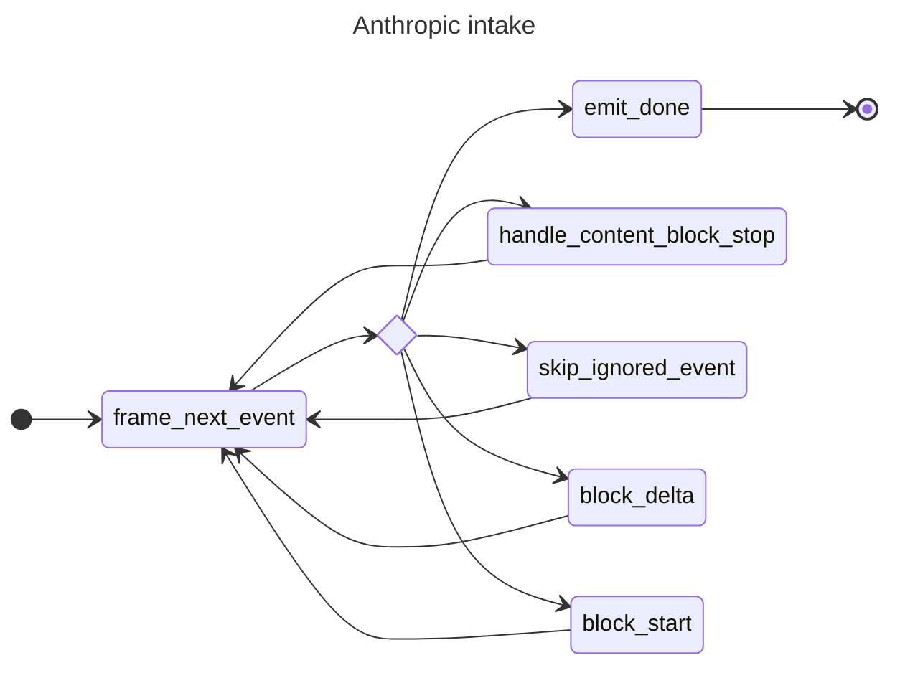
```mermaid
---
title: Anthropic intake
---
stateDiagram-v2
  direction LR
  frame_next_event
  state decision <<choice>>
  emit_done
  handle_content_block_stop
  skip_ignored_event
  subgraph_anthropic_block_delta_dispatch: block_delta
  subgraph_anthropic_block_start_dispatch: block_start

  [*] --> frame_next_event
  frame_next_event --> decision
  decision --> emit_done
  decision --> handle_content_block_stop
  decision --> skip_ignored_event
  decision --> subgraph_anthropic_block_delta_dispatch
  decision --> subgraph_anthropic_block_start_dispatch
  handle_content_block_stop --> frame_next_event
  skip_ignored_event --> frame_next_event
  subgraph_anthropic_block_delta_dispatch --> frame_next_event
  subgraph_anthropic_block_start_dispatch --> frame_next_event
  emit_done --> [*]
```

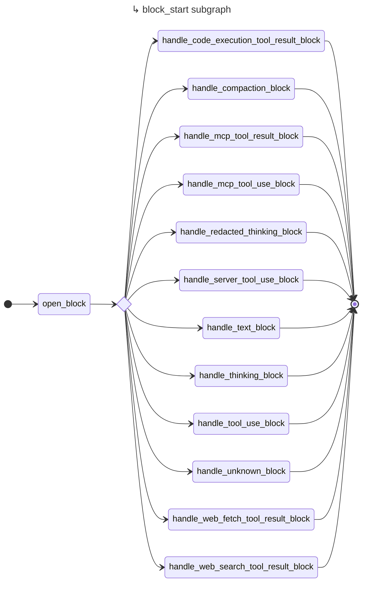
```mermaid
---
title: ↳ block_start subgraph
---
stateDiagram-v2
  direction LR
  open_block
  state decision <<choice>>
  handle_code_execution_tool_result_block
  handle_compaction_block
  handle_mcp_tool_result_block
  handle_mcp_tool_use_block
  handle_redacted_thinking_block
  handle_server_tool_use_block
  handle_text_block
  handle_thinking_block
  handle_tool_use_block
  handle_unknown_block
  handle_web_fetch_tool_result_block
  handle_web_search_tool_result_block

  [*] --> open_block
  open_block --> decision
  decision --> handle_code_execution_tool_result_block
  decision --> handle_compaction_block
  decision --> handle_mcp_tool_result_block
  decision --> handle_mcp_tool_use_block
  decision --> handle_redacted_thinking_block
  decision --> handle_server_tool_use_block
  decision --> handle_text_block
  decision --> handle_thinking_block
  decision --> handle_tool_use_block
  decision --> handle_unknown_block
  decision --> handle_web_fetch_tool_result_block
  decision --> handle_web_search_tool_result_block
  handle_code_execution_tool_result_block --> [*]
  handle_compaction_block --> [*]
  handle_mcp_tool_result_block --> [*]
  handle_mcp_tool_use_block --> [*]
  handle_redacted_thinking_block --> [*]
  handle_server_tool_use_block --> [*]
  handle_text_block --> [*]
  handle_thinking_block --> [*]
  handle_tool_use_block --> [*]
  handle_unknown_block --> [*]
  handle_web_fetch_tool_result_block --> [*]
  handle_web_search_tool_result_block --> [*]
```

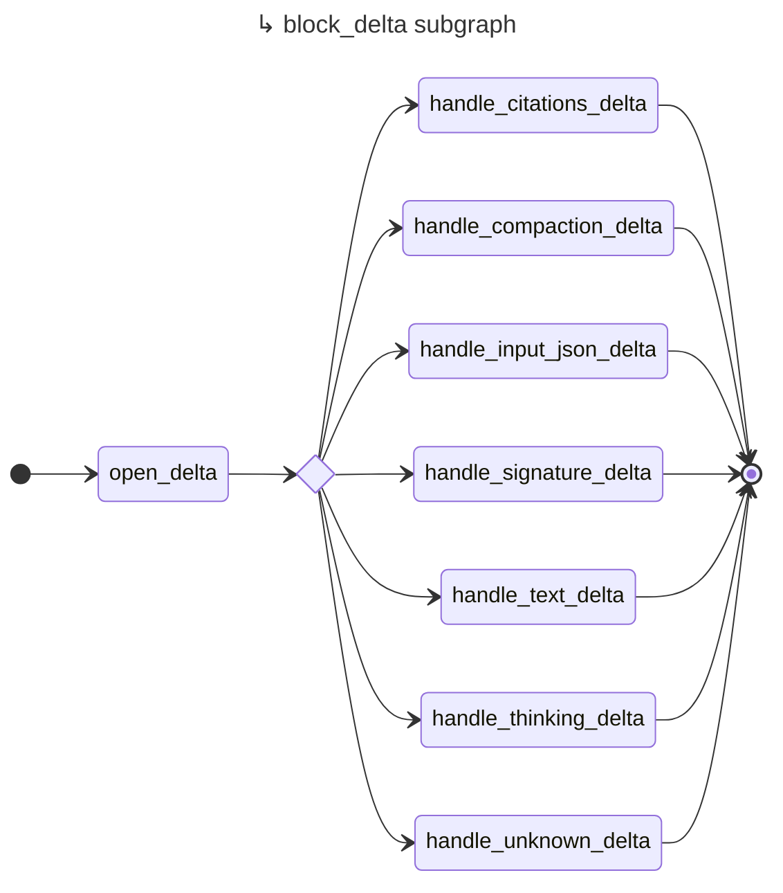
```mermaid
---
title: ↳ block_delta subgraph
---
stateDiagram-v2
  direction LR
  open_delta
  state decision <<choice>>
  handle_citations_delta
  handle_compaction_delta
  handle_input_json_delta
  handle_signature_delta
  handle_text_delta
  handle_thinking_delta
  handle_unknown_delta

  [*] --> open_delta
  open_delta --> decision
  decision --> handle_citations_delta
  decision --> handle_compaction_delta
  decision --> handle_input_json_delta
  decision --> handle_signature_delta
  decision --> handle_text_delta
  decision --> handle_thinking_delta
  decision --> handle_unknown_delta
  handle_citations_delta --> [*]
  handle_compaction_delta --> [*]
  handle_input_json_delta --> [*]
  handle_signature_delta --> [*]
  handle_text_delta --> [*]
  handle_thinking_delta --> [*]
  handle_unknown_delta --> [*]
```

## INTAKE — OpenAI Chat

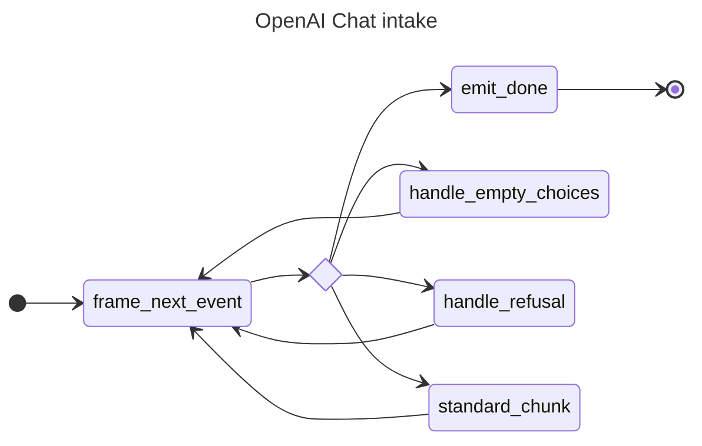
```mermaid
---
title: OpenAI Chat intake
---
stateDiagram-v2
  direction LR
  frame_next_event
  state decision <<choice>>
  emit_done
  handle_empty_choices
  handle_refusal
  subgraph_openai_standard_chunk_dispatch: standard_chunk

  [*] --> frame_next_event
  frame_next_event --> decision
  decision --> emit_done
  decision --> handle_empty_choices
  decision --> handle_refusal
  decision --> subgraph_openai_standard_chunk_dispatch
  handle_empty_choices --> frame_next_event
  handle_refusal --> frame_next_event
  subgraph_openai_standard_chunk_dispatch --> frame_next_event
  emit_done --> [*]
```

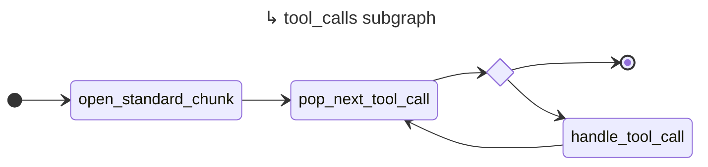
```mermaid
---
title: ↳ tool_calls subgraph
---
stateDiagram-v2
  direction LR
  open_standard_chunk
  pop_next_tool_call
  state decision <<choice>>
  handle_tool_call

  [*] --> open_standard_chunk
  open_standard_chunk --> pop_next_tool_call
  pop_next_tool_call --> decision
  decision --> [*]
  decision --> handle_tool_call
  handle_tool_call --> pop_next_tool_call
```

## INTAKE — OpenAI Responses

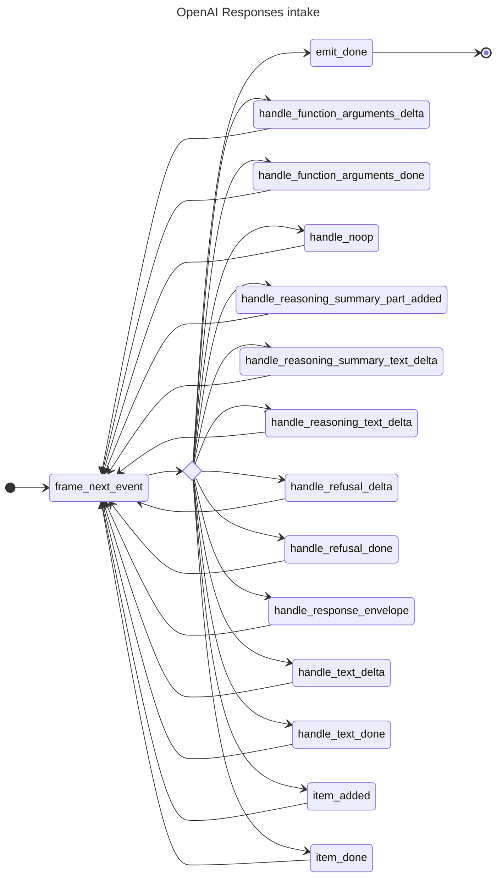
```mermaid
---
title: OpenAI Responses intake
---
stateDiagram-v2
  direction LR
  frame_next_event
  state decision <<choice>>
  emit_done
  handle_function_arguments_delta
  handle_function_arguments_done
  handle_noop
  handle_reasoning_summary_part_added
  handle_reasoning_summary_text_delta
  handle_reasoning_text_delta
  handle_refusal_delta
  handle_refusal_done
  handle_response_envelope
  handle_text_delta
  handle_text_done
  subgraph_openai_responses_item_added_dispatch: item_added
  subgraph_openai_responses_item_done_dispatch: item_done

  [*] --> frame_next_event
  frame_next_event --> decision
  decision --> emit_done
  decision --> handle_function_arguments_delta
  decision --> handle_function_arguments_done
  decision --> handle_noop
  decision --> handle_reasoning_summary_part_added
  decision --> handle_reasoning_summary_text_delta
  decision --> handle_reasoning_text_delta
  decision --> handle_refusal_delta
  decision --> handle_refusal_done
  decision --> handle_response_envelope
  decision --> handle_text_delta
  decision --> handle_text_done
  decision --> subgraph_openai_responses_item_added_dispatch
  decision --> subgraph_openai_responses_item_done_dispatch
  handle_function_arguments_delta --> frame_next_event
  handle_function_arguments_done --> frame_next_event
  handle_noop --> frame_next_event
  handle_reasoning_summary_part_added --> frame_next_event
  handle_reasoning_summary_text_delta --> frame_next_event
  handle_reasoning_text_delta --> frame_next_event
  handle_refusal_delta --> frame_next_event
  handle_refusal_done --> frame_next_event
  handle_response_envelope --> frame_next_event
  handle_text_delta --> frame_next_event
  handle_text_done --> frame_next_event
  subgraph_openai_responses_item_added_dispatch --> frame_next_event
  subgraph_openai_responses_item_done_dispatch --> frame_next_event
  emit_done --> [*]
```

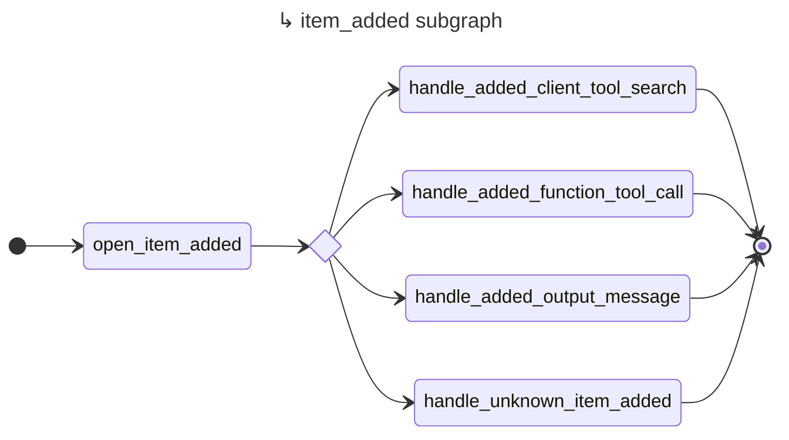
```mermaid
---
title: ↳ item_added subgraph
---
stateDiagram-v2
  direction LR
  open_item_added
  state decision <<choice>>
  handle_added_client_tool_search
  handle_added_function_tool_call
  handle_added_output_message
  handle_unknown_item_added

  [*] --> open_item_added
  open_item_added --> decision
  decision --> handle_added_client_tool_search
  decision --> handle_added_function_tool_call
  decision --> handle_added_output_message
  decision --> handle_unknown_item_added
  handle_added_client_tool_search --> [*]
  handle_added_function_tool_call --> [*]
  handle_added_output_message --> [*]
  handle_unknown_item_added --> [*]
```

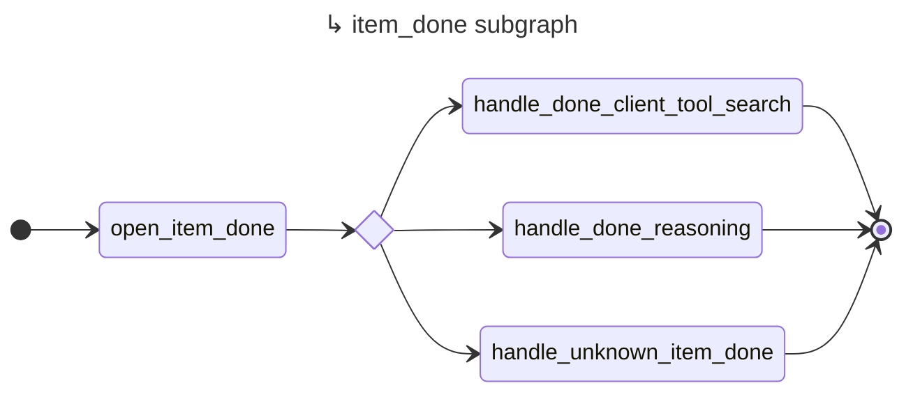
```mermaid
---
title: ↳ item_done subgraph
---
stateDiagram-v2
  direction LR
  open_item_done
  state decision <<choice>>
  handle_done_client_tool_search
  handle_done_reasoning
  handle_unknown_item_done

  [*] --> open_item_done
  open_item_done --> decision
  decision --> handle_done_client_tool_search
  decision --> handle_done_reasoning
  decision --> handle_unknown_item_done
  handle_done_client_tool_search --> [*]
  handle_done_reasoning --> [*]
  handle_unknown_item_done --> [*]
```

## INTAKE — Google / Gemini / Vertex

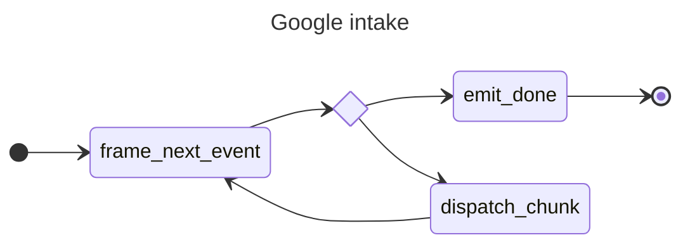
```mermaid
---
title: Google intake
---
stateDiagram-v2
  direction LR
  frame_next_event
  state decision <<choice>>
  emit_done
  subgraph_google_chunk_dispatch: dispatch_chunk

  [*] --> frame_next_event
  frame_next_event --> decision
  decision --> emit_done
  decision --> subgraph_google_chunk_dispatch
  subgraph_google_chunk_dispatch --> frame_next_event
  emit_done --> [*]
```

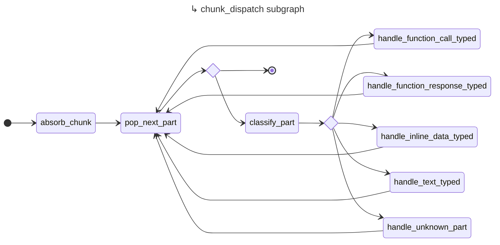
```mermaid
---
title: ↳ chunk_dispatch subgraph
---
stateDiagram-v2
  direction LR
  absorb_chunk
  pop_next_part
  state decision <<choice>>
  classify_part
  state decision_2 <<choice>>
  handle_function_call_typed
  handle_function_response_typed
  handle_inline_data_typed
  handle_text_typed
  handle_unknown_part

  [*] --> absorb_chunk
  absorb_chunk --> pop_next_part
  pop_next_part --> decision
  decision --> [*]
  decision --> classify_part
  classify_part --> decision_2
  decision_2 --> handle_function_call_typed
  decision_2 --> handle_function_response_typed
  decision_2 --> handle_inline_data_typed
  decision_2 --> handle_text_typed
  decision_2 --> handle_unknown_part
  handle_function_call_typed --> pop_next_part
  handle_function_response_typed --> pop_next_part
  handle_inline_data_typed --> pop_next_part
  handle_text_typed --> pop_next_part
  handle_unknown_part --> pop_next_part
```

## INTAKE — Perplexity

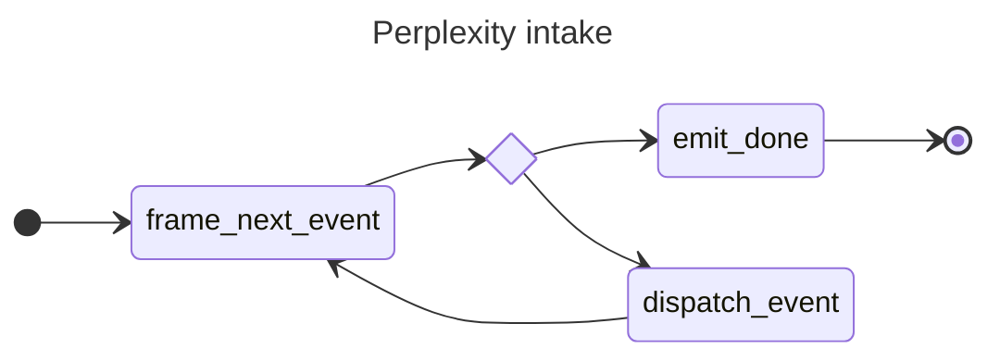
```mermaid
---
title: Perplexity intake
---
stateDiagram-v2
  direction LR
  frame_next_event
  state decision <<choice>>
  emit_done
  subgraph_pplx_event_dispatch: dispatch_event

  [*] --> frame_next_event
  frame_next_event --> decision
  decision --> emit_done
  decision --> subgraph_pplx_event_dispatch
  subgraph_pplx_event_dispatch --> frame_next_event
  emit_done --> [*]
```

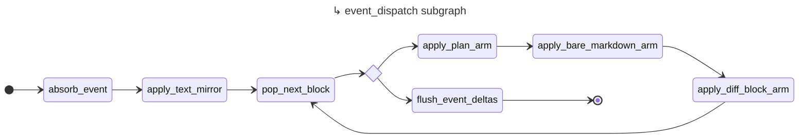
```mermaid
---
title: ↳ event_dispatch subgraph
---
stateDiagram-v2
  direction LR
  absorb_event
  apply_text_mirror
  pop_next_block
  state decision <<choice>>
  apply_plan_arm
  flush_event_deltas
  apply_bare_markdown_arm
  apply_diff_block_arm

  [*] --> absorb_event
  absorb_event --> apply_text_mirror
  apply_text_mirror --> pop_next_block
  pop_next_block --> decision
  decision --> apply_plan_arm
  decision --> flush_event_deltas
  apply_plan_arm --> apply_bare_markdown_arm
  flush_event_deltas --> [*]
  apply_bare_markdown_arm --> apply_diff_block_arm
  apply_diff_block_arm --> pop_next_block
```

## INTAKE — OpenAI Conversations (ChatGPT)

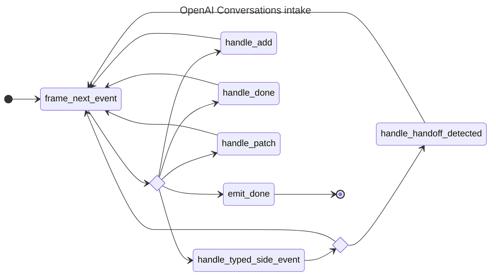
```mermaid
---
title: OpenAI Conversations intake
---
stateDiagram-v2
  direction LR
  frame_next_event
  state decision <<choice>>
  emit_done
  handle_add
  handle_done
  handle_patch
  handle_typed_side_event
  state decision_2 <<choice>>
  handle_handoff_detected

  [*] --> frame_next_event
  frame_next_event --> decision
  decision --> emit_done
  decision --> handle_add
  decision --> handle_done
  decision --> handle_patch
  decision --> handle_typed_side_event
  handle_add --> frame_next_event
  handle_done --> frame_next_event
  handle_patch --> frame_next_event
  emit_done --> [*]
  handle_typed_side_event --> decision_2
  decision_2 --> frame_next_event
  decision_2 --> handle_handoff_detected
  handle_handoff_detected --> frame_next_event
```

## RENDER — Anthropic Messages

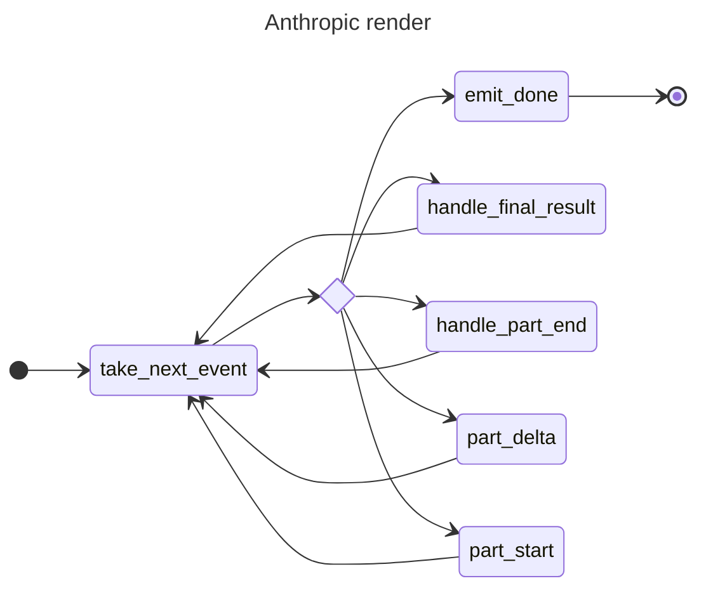
```mermaid
---
title: Anthropic render
---
stateDiagram-v2
  direction LR
  take_next_event
  state decision <<choice>>
  emit_done
  handle_final_result
  handle_part_end
  subgraph_anthropic_render_part_delta: part_delta
  subgraph_anthropic_render_part_start: part_start

  [*] --> take_next_event
  take_next_event --> decision
  decision --> emit_done
  decision --> handle_final_result
  decision --> handle_part_end
  decision --> subgraph_anthropic_render_part_delta
  decision --> subgraph_anthropic_render_part_start
  handle_final_result --> take_next_event
  handle_part_end --> take_next_event
  subgraph_anthropic_render_part_delta --> take_next_event
  subgraph_anthropic_render_part_start --> take_next_event
  emit_done --> [*]
```

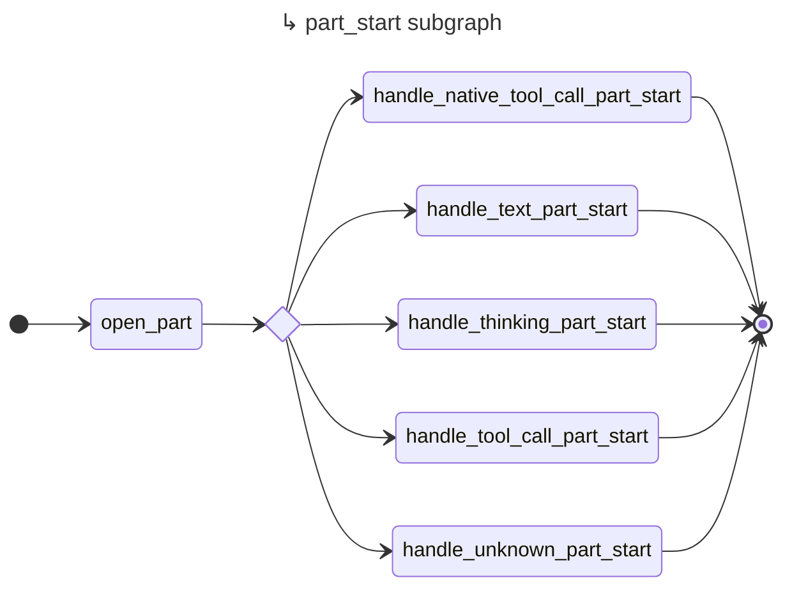
```mermaid
---
title: ↳ part_start subgraph
---
stateDiagram-v2
  direction LR
  open_part
  state decision <<choice>>
  handle_native_tool_call_part_start
  handle_text_part_start
  handle_thinking_part_start
  handle_tool_call_part_start
  handle_unknown_part_start

  [*] --> open_part
  open_part --> decision
  decision --> handle_native_tool_call_part_start
  decision --> handle_text_part_start
  decision --> handle_thinking_part_start
  decision --> handle_tool_call_part_start
  decision --> handle_unknown_part_start
  handle_native_tool_call_part_start --> [*]
  handle_text_part_start --> [*]
  handle_thinking_part_start --> [*]
  handle_tool_call_part_start --> [*]
  handle_unknown_part_start --> [*]
```

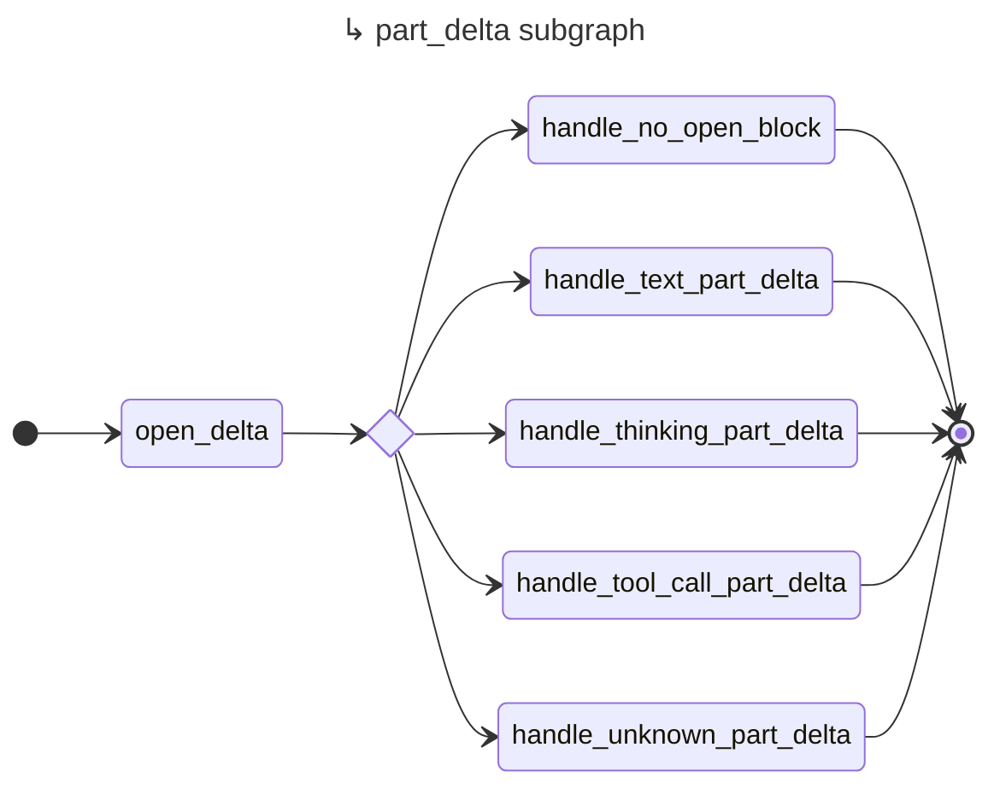
```mermaid
---
title: ↳ part_delta subgraph
---
stateDiagram-v2
  direction LR
  open_delta
  state decision <<choice>>
  handle_no_open_block
  handle_text_part_delta
  handle_thinking_part_delta
  handle_tool_call_part_delta
  handle_unknown_part_delta

  [*] --> open_delta
  open_delta --> decision
  decision --> handle_no_open_block
  decision --> handle_text_part_delta
  decision --> handle_thinking_part_delta
  decision --> handle_tool_call_part_delta
  decision --> handle_unknown_part_delta
  handle_no_open_block --> [*]
  handle_text_part_delta --> [*]
  handle_thinking_part_delta --> [*]
  handle_tool_call_part_delta --> [*]
  handle_unknown_part_delta --> [*]
```

## RENDER — OpenAI Chat Completions

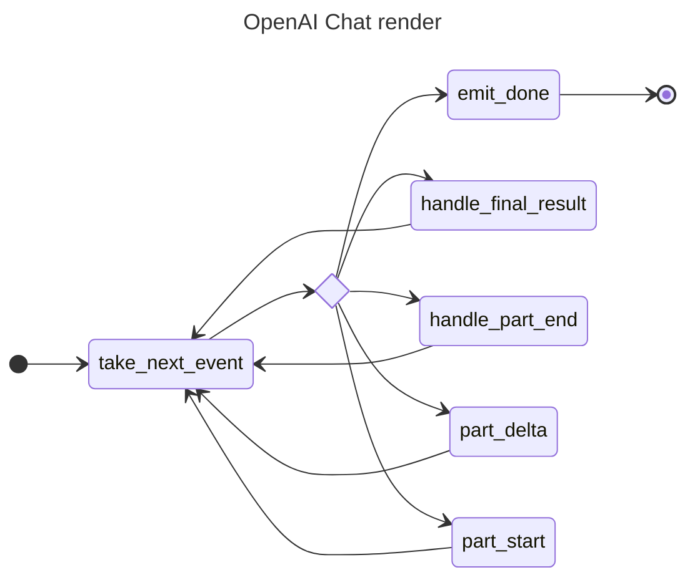
```mermaid
---
title: OpenAI Chat render
---
stateDiagram-v2
  direction LR
  take_next_event
  state decision <<choice>>
  emit_done
  handle_final_result
  handle_part_end
  subgraph_openai_render_part_delta: part_delta
  subgraph_openai_render_part_start: part_start

  [*] --> take_next_event
  take_next_event --> decision
  decision --> emit_done
  decision --> handle_final_result
  decision --> handle_part_end
  decision --> subgraph_openai_render_part_delta
  decision --> subgraph_openai_render_part_start
  handle_final_result --> take_next_event
  handle_part_end --> take_next_event
  subgraph_openai_render_part_delta --> take_next_event
  subgraph_openai_render_part_start --> take_next_event
  emit_done --> [*]
```

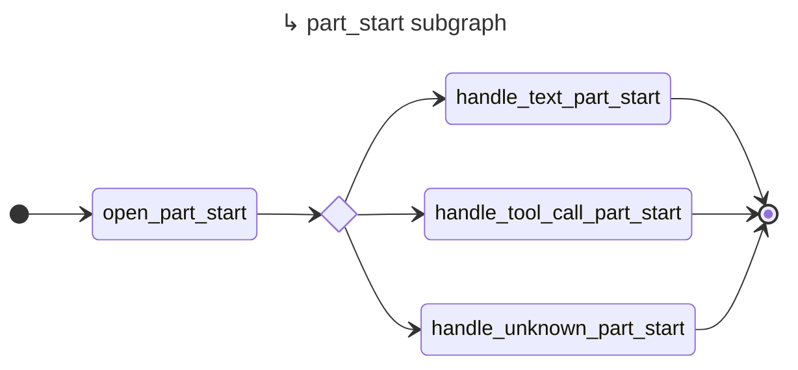
```mermaid
---
title: ↳ part_start subgraph
---
stateDiagram-v2
  direction LR
  open_part_start
  state decision <<choice>>
  handle_text_part_start
  handle_tool_call_part_start
  handle_unknown_part_start

  [*] --> open_part_start
  open_part_start --> decision
  decision --> handle_text_part_start
  decision --> handle_tool_call_part_start
  decision --> handle_unknown_part_start
  handle_text_part_start --> [*]
  handle_tool_call_part_start --> [*]
  handle_unknown_part_start --> [*]
```

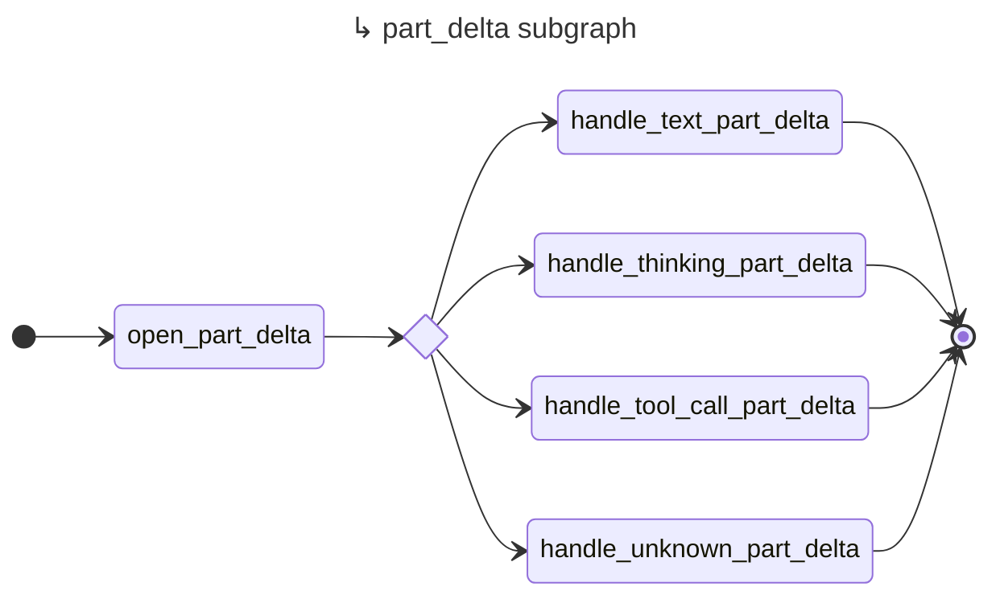
```mermaid
---
title: ↳ part_delta subgraph
---
stateDiagram-v2
  direction LR
  open_part_delta
  state decision <<choice>>
  handle_text_part_delta
  handle_thinking_part_delta
  handle_tool_call_part_delta
  handle_unknown_part_delta

  [*] --> open_part_delta
  open_part_delta --> decision
  decision --> handle_text_part_delta
  decision --> handle_thinking_part_delta
  decision --> handle_tool_call_part_delta
  decision --> handle_unknown_part_delta
  handle_text_part_delta --> [*]
  handle_thinking_part_delta --> [*]
  handle_tool_call_part_delta --> [*]
  handle_unknown_part_delta --> [*]
```

## RENDER — OpenAI Responses

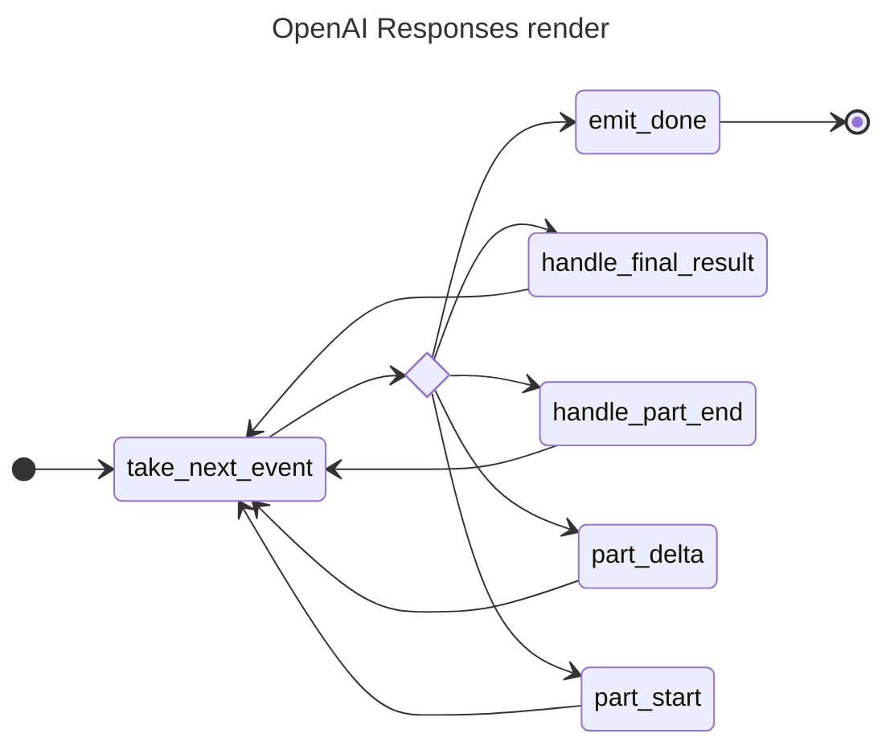
```mermaid
---
title: OpenAI Responses render
---
stateDiagram-v2
  direction LR
  take_next_event
  state decision <<choice>>
  emit_done
  handle_final_result
  handle_part_end
  subgraph_openai_responses_render_part_delta: part_delta
  subgraph_openai_responses_render_part_start: part_start

  [*] --> take_next_event
  take_next_event --> decision
  decision --> emit_done
  decision --> handle_final_result
  decision --> handle_part_end
  decision --> subgraph_openai_responses_render_part_delta
  decision --> subgraph_openai_responses_render_part_start
  handle_final_result --> take_next_event
  handle_part_end --> take_next_event
  subgraph_openai_responses_render_part_delta --> take_next_event
  subgraph_openai_responses_render_part_start --> take_next_event
  emit_done --> [*]
```

```mermaid
---
title: ↳ part_start subgraph
---
stateDiagram-v2
  direction LR
  open_responses_part
  state decision <<choice>>
  handle_text_part_start
  handle_thinking_part_start
  handle_tool_call_part_start
  handle_unknown_part_start

  [*] --> open_responses_part
  open_responses_part --> decision
  decision --> handle_text_part_start
  decision --> handle_thinking_part_start
  decision --> handle_tool_call_part_start
  decision --> handle_unknown_part_start
  handle_text_part_start --> [*]
  handle_thinking_part_start --> [*]
  handle_tool_call_part_start --> [*]
  handle_unknown_part_start --> [*]
```

```mermaid
---
title: ↳ part_delta subgraph
---
stateDiagram-v2
  direction LR
  open_responses_delta
  state decision <<choice>>
  handle_delta_no_item
  split_resolved_delta
  state decision_2 <<choice>>
  handle_text_part_delta
  handle_thinking_part_delta
  handle_tool_call_part_delta
  handle_unknown_part_delta

  [*] --> open_responses_delta
  open_responses_delta --> decision
  decision --> handle_delta_no_item
  decision --> split_resolved_delta
  handle_delta_no_item --> [*]
  split_resolved_delta --> decision_2
  decision_2 --> handle_text_part_delta
  decision_2 --> handle_thinking_part_delta
  decision_2 --> handle_tool_call_part_delta
  decision_2 --> handle_unknown_part_delta
  handle_text_part_delta --> [*]
  handle_thinking_part_delta --> [*]
  handle_tool_call_part_delta --> [*]
  handle_unknown_part_delta --> [*]
```
